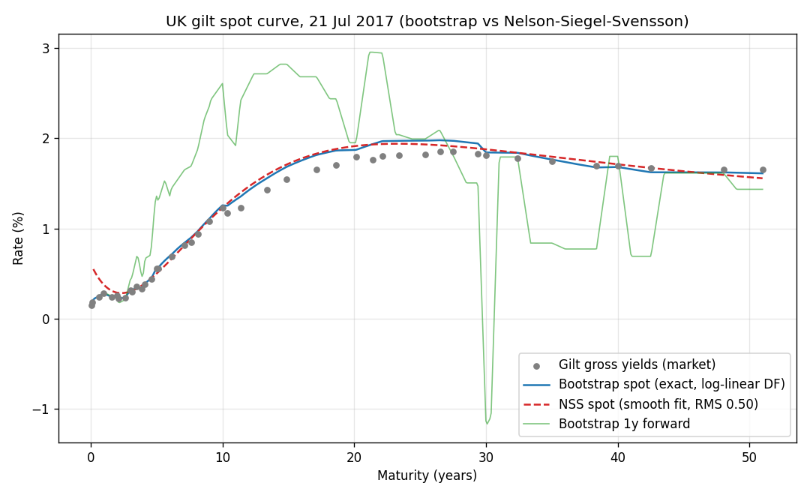

# Gilt Spot-Curve Bootstrapper

Bootstrap a spot (zero) rate curve from liquid UK gilt prices, then use that curve
to compute Z-spreads on other bonds.

This is a learning project — it prioritises clarity and correctness over cleverness
or performance, and builds the quant logic from scratch (numpy/scipy only, no
heavyweight quant libraries).

## Results

Bootstrapped from 44 real UK gilts (DMO close of business, 21 July 2017). The
bootstrap reprices every input gilt to within rounding (<1e-6), and a
Nelson-Siegel-Svensson curve is fitted to the same prices for comparison.



The bootstrap spot curve (blue) passes through the market exactly but its implied
forwards (green) are noisy on the sparse long end; the NSS fit (red) is smooth at the
cost of a small pricing residual. Regenerate with `python scripts/plot_curve.py`.

## Setup

```bash
python3 -m venv .venv
source .venv/bin/activate
pip install -r requirements.txt
```

## Usage

The library is used in three steps, each handled by one module.

First, load the market data. Calling `load_gilts()` from `gilt_bootstrapper.data`
fetches a real set of UK gilt reference prices from the Debt Management Office (a
snapshot from 21 July 2017), filters them down to conventional gilts, and returns
them as a list. The file is downloaded once and cached locally, so later calls are
offline. You can pass a different settlement date to pick another business day.

Second, build the curve. Passing that list of gilts to `bootstrap()` from
`gilt_bootstrapper.bootstrap` solves for the spot (zero) rate curve that reprices
every gilt to its market price, and returns a curve object. From that object you can
ask for the discount factor, the zero rate, or a forward rate at any maturity.

Third, measure relative value. Given the curve and a bond, `z_spread_gilt()` from
`gilt_bootstrapper.zspread` returns the bond's Z-spread — the constant spread over
the curve that reproduces its price. A gilt that was used to build the curve has a
Z-spread of essentially zero; a bond trading cheap to the curve has a positive
spread, and one trading rich has a negative spread.

## Relative value

The point of the curve is to price other bonds against it. `scripts/relative_value.py`
computes the Z-spread — the constant spread over the gilt curve that reproduces a
bond's price — for two instruments:

- A real gilt **STRIP** taken straight from the DMO file (fully data-driven): the
  ~2037 strip prices at about **+5 bp**, i.e. marginally cheap to the curve.
- A real GBP supranational, **EIB 5.625% 2032**, at an illustrative price: about
  **+20 bp** over gilts, the kind of level a AAA agency trades at.

(The EIB price is illustrative — free historical single-bond prices are scarce — but
its coupon and maturity are real, and the STRIP figure is fully reproducible.)

## Running tests

By default `pytest` runs the offline unit tests against a small committed data
sample. Setting the environment variable `RUN_NETWORK_TESTS=1` additionally runs the
checks that download the live DMO file and validate against all 44 gilts.

```bash
pytest
```
